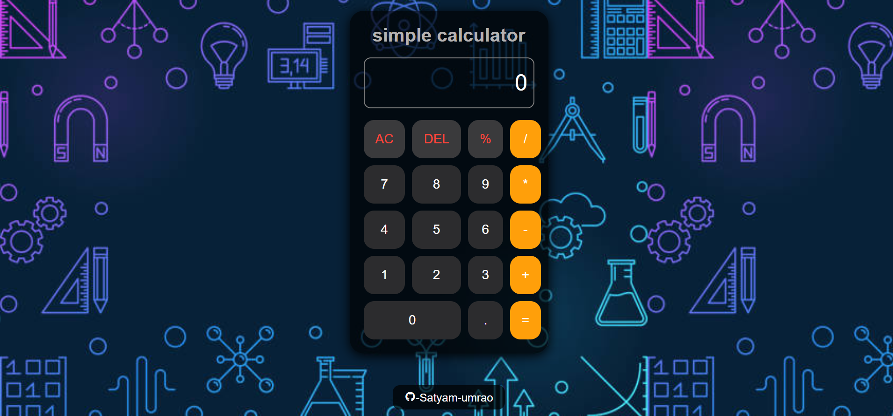

# Simple Calculator

[Live Demo](https://satyam-umrao.github.io/Simple-Calculator/)

A simple, responsive web-based calculator built using HTML, CSS, and JavaScript. This project performs basic arithmetic operations like addition, subtraction, multiplication, and division, making it ideal for beginners looking to understand DOM manipulation and event handling in JavaScript.

## 🔗 Link
👉 [Visit the Calculator](https://satyam-umrao.github.io/Simple-Calculator/)

## 🛠️ Built With

- **HTML5** – Structure of the webpage
- **CSS3** – Styling for the calculator UI
- **JavaScript** – Functionality and logic

## ✨ Features

- Basic arithmetic operations: Add, Subtract, Multiply, Divide
- User-friendly interface
- Responsive design for mobile and desktop
- Clear and Delete functionality

## 📷 Preview

 <!-- Replace with an actual screenshot URL if available -->

## 🚀 Getting Started

To run this project locally:

1. Clone the repository:
   ```bash
   git clone https://github.com/satyam-umrao/Simple-Calculator.git

2. Open index.html in your browser.

## 🤝 Contributing
Contributions are welcome! If you'd like to improve the calculator or add new features, feel free to fork the repo and submit a pull request.

## Made with ❤️ by Satyam Umrao
